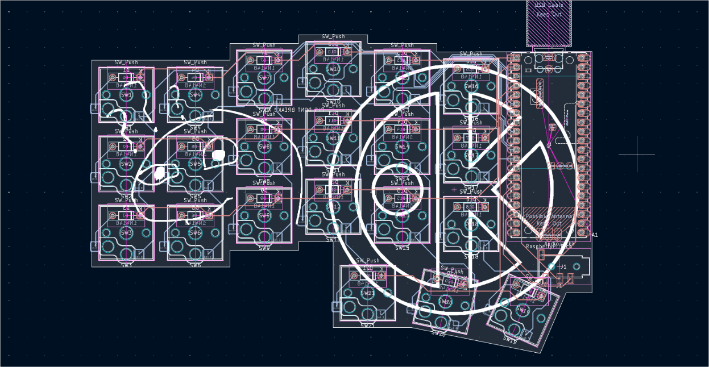

# Orpheus split JOURNAL
here are all my devlogs on this project

# Devlog 4
_~2h_
I completly finished the left half of the pcb, and started to work on the right side. I realized, that I will need to make the right half from scratch, because I cant mirror some components the right way...

here is a screenshot: 

# Devlog 3
_~2h_

I placed all the switches and diodes on the right places - now it looks like this:

Next I will be wiring the thing XD

# Devlog 2
_55 minutes_
Created a github repository and started working on the pcb. The keyboard matrix is ready, next i will assign all the footprints.

# Devlog 1
_??? minutes_
I spent some time thinking about the layout, and decided to go with a corne. 
Also I choose that its will be a wired keyboard, where the two halves will be connected via TRRS.

## Keyboard design
- 6*3+3 keys per side - 42 keys in total
- corne layout
- wired (TRRS)
- QMK software
- orpeus pico microcotroller

Now I am going to design the pcb

